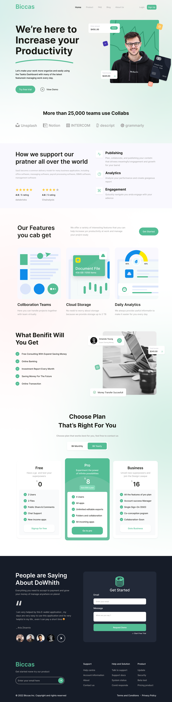
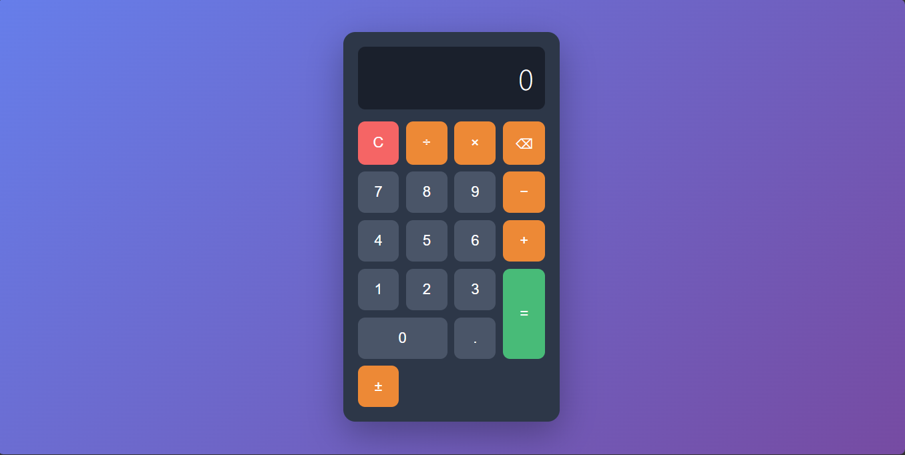
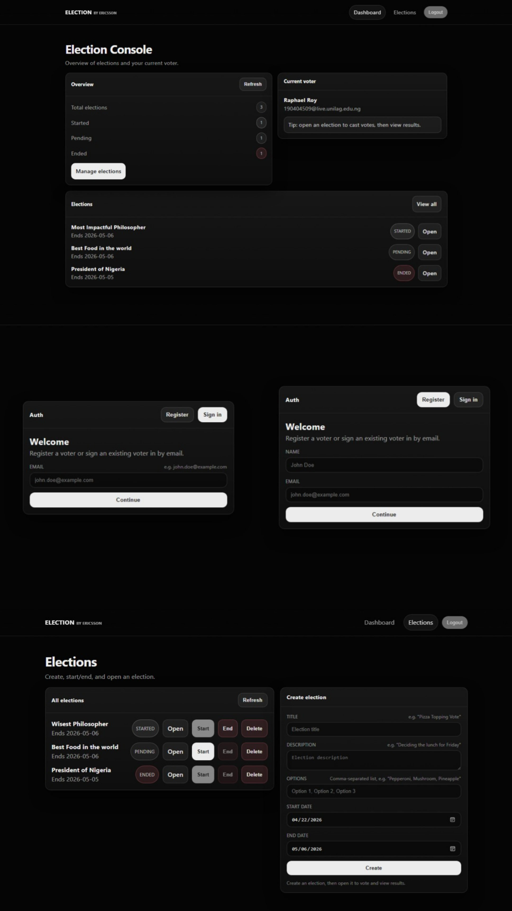

# Premium Frontend Showcase

A curated collection of high-fidelity, responsive web experiences. This repository exhibits modern design principles, fluid interactivity, and pixel-perfect layouts crafted with HTML, CSS, JavaScript, React, and TypeScript.

## Projects

### 1. Biccas Landing Page

A modern solution for various business needs, featuring a hero section, feature grids, and interactive pricing with dynamic hover effects.

**Preview:**

### 2. Educlass Landing Page

A modern solution for education, providing dashboards for monitoring student performance, attendance rates, and test scores. It includes a sticky navigation bar with a glassmorphism effect on scroll.

**Preview:**

### 3. Base Apparel Coming Soon

A minimalist coming-soon page with sophisticated typography, a clean layout, and a responsive design that adapts seamlessly between desktop and mobile devices.

**Preview:**

### 4. Calculator

A fully functional calculator built using Test-Driven Development (TDD). It supports core arithmetic operations, keyboard navigation, and features a clean, professional dark-mode UI.

**Preview:**

### 5. Election Management System

An election management system built with React and TypeScript, featuring user authentication, dashboard, voting functionality, and results tracking.

**Preview:**

## Key Features

- **Responsive Design**: All projects are fully optimized for both desktop and mobile viewports.
- **Modern Aesthetics**: Utilizes vibrant color palettes, sleek typography, and contemporary design elements like glassmorphism.
- **Interactive UI**: Includes hover states, micro-animations, and dynamic navigation effects.
- **State Management**: Leverages Redux for managing complex application state in React projects.
- **Type Safety**: Employs TypeScript for enhanced code reliability and developer experience.
- **Build Tooling**: Uses Vite for rapid development servers and efficient builds.

## Technologies Used

- HTML5 & CSS3
- Modern Typography (Google Fonts: Outfit, DM Sans, Poppins, Josefin Sans)
- Layout Techniques (CSS Flexbox, CSS Grid)
- Vanilla JavaScript (for small interactive enhancements)
- React & JSX (for component-based applications)
- TypeScript (for type-safe development)
- Vite (for fast build tooling and development servers)
- Node.js & npm (for package management and dependencies)
- Redux (for state management in React applications)
- ESLint (for code linting and quality)

## How to View

### Static Projects (Biccas, Educlass, BaseApparel, Calculator)

1. Navigate to the desired project directory.
2. Open the `index.html` file in any modern web browser.

### Dynamic Projects (Election)

1. Navigate to the desired project directory.
2. Run `npm install` to install dependencies.
3. Run `npm run dev` to start the development server.
4. Open the provided URL (usually `http://localhost:5173`) in a browser.

For projects with package.json (like Calculator and Election), you may need to install dependencies with `npm install` and run the development server with `npm run dev`.
